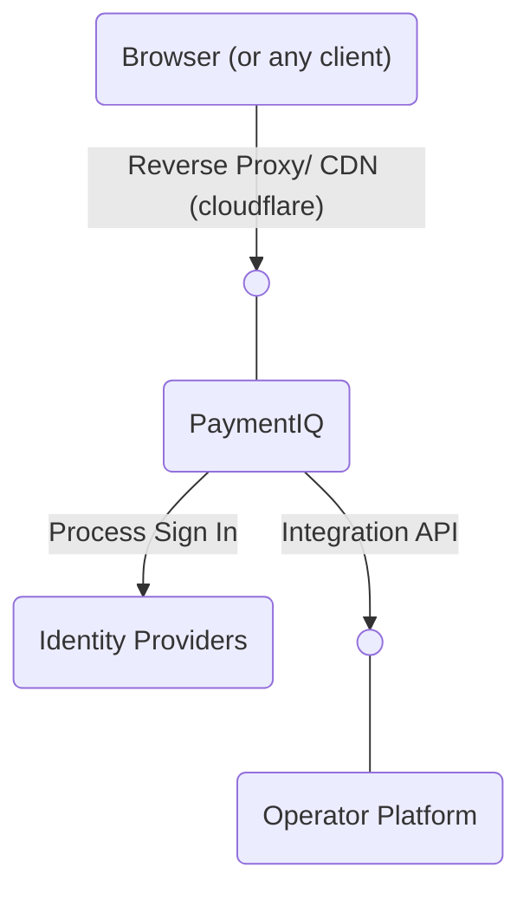

One of the main architectural goals with PaymentIQ is to have it loosely coupled from the operator’s platform so the two systems can evolve independently without affecting each other. For example identity providers can be added, modified or updated without affecting the operator’s platform.

In order to achieve the separations of concerns, the integration between the operator’s platform and PaymentIQ is reverted, i.e. PaymentIQ calls the Operator Platform instead of the Operator platform calls PaymentIQ.

Therefore, the operator needs to implement the Integration API as specified in this document.
