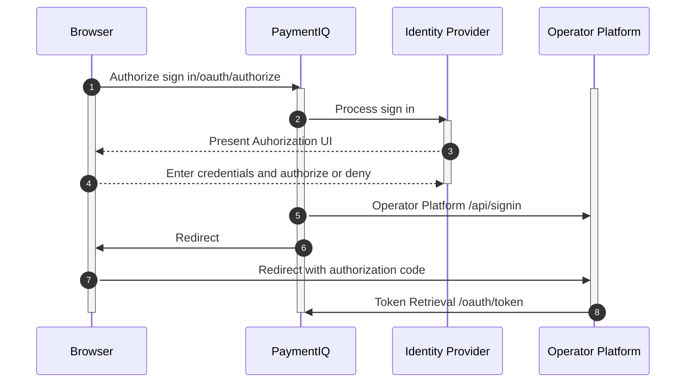

The sign in and sign up flow is used for signing in or creating the user in merchant site. In most cases, the sign in flow consists of a combination of username & password. Utilizing the 1-Click API flow will allow any user to sign in with any identity provider available. The outcome will lead to a more powerful and seamless user experience.

## Control Flow

The flow is based on OAuth2 standard. It should be an easy and seamless integration with 1-Click API since it is using standards.
Client libraries are available for most platforms that will handle the integration with a minimum of configuration.

The control flow is achieved between four parties. The browser where the user initiates and completes the flow. The PaymentIQ system which handles most of the business logic. The identity provider which handles the identity verification and KYC retrieval. And finally, the operator platform which handles notification and token retrieval.

## API Flow

The following flowchart below shows how the API flow works. The following steps describe the flow from top to bottom.

1. Client initiates the flow by calling the authorization endpoint.
2. PaymentIQ process the sign in request via requested identity provider.
3. Client should be presented with the identity provider URL or HTML where the user can start identification process.
4. User should enter the required credentials needed by the identity provider.
5. PaymentIQ waits for identification to be completed. When verified PaymentIQ will send the KYC data to operator platform via sign in notification. The operator needs to verify the KYC and decide if the user is allowed to sign in or not. This is required for Trustly but can be used with other identity providers if the customer wants. See more [here](1click_api_force_sign_in_call).
6. PaymentIQ redirects end user back to the redirect_uri of the operator site with one time code.
7. PaymentIQ redirects end user back to the redirect_uri of the operator site with one time code.
8. Operator platform calls the token endpoint with the one time code and gets an access_token.

After `/oauth/token` the merchant should take the decision to create a valid session for the user.

If PaymentIQ has done a `/api/signin` then it's usually unnecessary to make a `/oauth/token` call because then the merchant already have gotten all KYC data.

If PaymentIQ has not done a `/api/signin` then the merchant needs to do a `/oauth/token` call to get KYC data.

The access token can be used later when calling the `api/check_token` endpoint to get KYC again.

## Notifications sent to Operator Platform

| Method      | Required                       | Description                                                                                                                                                                                                                                          |
|-------------|--------------------------------|------------------------------------------------------------------------------------------------------------------------------------------------------------------------------------------------------------------------------------------------------|
| /api/signin | Trustly, SumSub, HooYu, Veriff | As described in step 5 PaymentIQ will send the KYC data to operator platform. The operator should check KYC data and decide if the user is allowed to sign in or not. For most identity providers the sign in notification is optional to implement. |

For more information see [Integration api](../../apis_and_integration/integration_api/signin).
