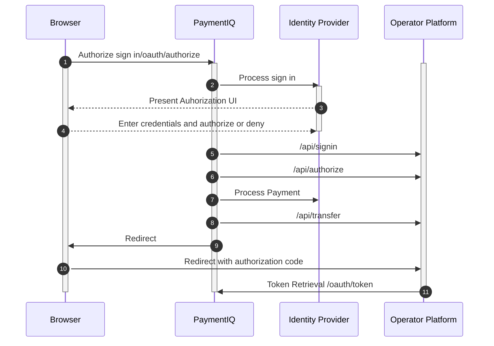

The sign up and deposit flow is nearly identical to the sign in flow.

In most cases, the sign in flow consist of a combination of username & password.
Utilizing the 1-Click API flow will allow any user to sign in with any identity provider available. The outcome will lead to a more powerful and seamless user experience.

## Control Flow

The flow is based on OAuth2 standard. It should be an easy and seamless integration with 1-Click API since it is using standards.
Client libraries are available for most platforms that will handle the integration with a minimum of configuration.

The control flow is achieved between four parties. The browser where the user initiates and completes the flow.
The PaymentIQ system which handles most of the business logic. The identity provider which handles the identity verification and KYC retrieval.
And finally, the operator platform which will handle optional notification and token retrieval.

## API Flow

The following flowchart below shows how the API flow works.

The following steps describe the flow from top to bottom.

1. Client initiates the flow by calling the authorization endpoint.
2. PaymentIQ process the sign in request via requested identity provider.
3. Client should be presented with the identity provider URL or HTML where the user can start identification process.
4. User should enter the required credentials needed by the identity provider.
5. PaymentIQ waits for identification to be completed. When verified PaymentIQ will send the KYC data to operator platform via sign in notification. The operator needs to verify the KYC and decide if user is allowed to sign in or not. The notification is required for Trustly but optional for other providers.
6. PaymentIQ will send authorize notification to authorize transaction.
7. Once authorized PaymentIQ will initiate the payment to provider.
8. PaymentIQ will send transfer notification when transaction has been verified.
9. PaymentIQ redirects end user back to the redirect_uri of the operator site with one time code.
10. PaymentIQ redirects end user back to the redirect_uri of the operator site with one time code.
11. Operator platform calls the token endpoint with the one time code and gets an access_token.
12. Operator platform can if they want call the /oauth/check_token endpoint to verify the token received above and also get address information about the user. This call is usually unnecessary if the operator platform has received a /signin call. Please note that if the operator uses Global Identity Integrator then they will do a call against SPAR that will be invoiced the operator.

## Notifications sent to Operator Platform

| Method         | Required | Description                                                                                                                                                                                                                                                                                                                                                                                                                                                                                                                              |
|----------------|----------|------------------------------------------------------------------------------------------------------------------------------------------------------------------------------------------------------------------------------------------------------------------------------------------------------------------------------------------------------------------------------------------------------------------------------------------------------------------------------------------------------------------------------------------|
| /api/signin    | Trustly  | As described in step 5 PaymentIQ will send the KYC data to the operator platform. The operator should check KYC data and decide if the user is allowed to sign in or not. For most identity providers the sign in notification is optional to implement.                                                                                                                                                                                                                                                                                 |
| /api/authorize | All      | This method is called by PaymentIQ, so the Operator Platform can authorize a payment before it is getting processed. The Operator Platform should verify that the user is allowed to process and also reserve amount for future debit and check that the user account will not be over debited. If the Operator Platform response is a success, then PaymentIQ will continue with the processing of the payment transaction. If not, then PaymentIQ will decline the transaction with the status code returned by the Operator Platform. |
| /api/transfer  | All      | This method is called by PaymentIQ after a successfully processed transaction to credit (increase) or debit (decrease) a user's account balance. Note: The Operator Platform must always accept a transfer request, even if it results in a negative user balance because the payment transaction has already been processed by the payment provider.                                                                                                                                                                                    |
| /api/cancel    | All      | This method is called by PaymentIQ after a failed transaction to cancel the previous authorize request, i.e. the Operator should release any reserved money from the user's account.                                                                                                                                                                                                                                                                                                                                                     |

For more information see [Integration api](../../apis_and_integration/integration_api/integration_api_introduction).
