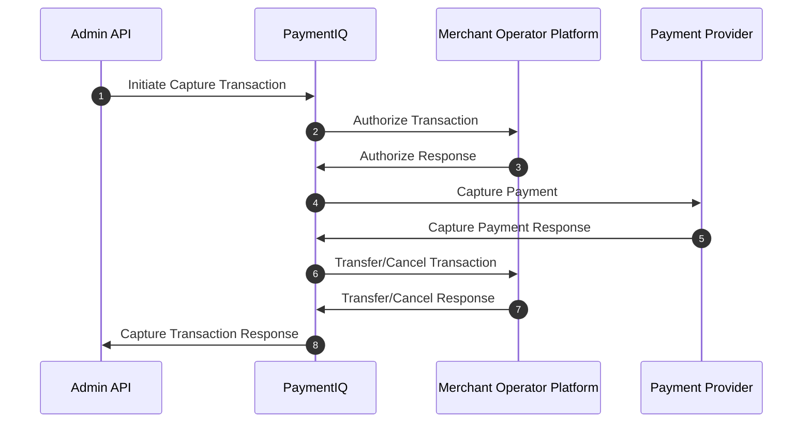

PaymentIQ offers various transaction types for the different transaction functions.

It will depend of the specific provider used if they are supported or not. Information on which are supported can be seen in the respective Provider Integration Manual.

In PaymentIQ you can see which transaction type a transaction is in the Transactions, Approve and Investigate Views in the column **Tx Type**

Capture transactions are initiated by the Merchant to capture a credit card transaction. Captures are initiated either via:

- The PaymentIQ Backoffice Investigate View.
- Rules set in PaymentIQ Backoffice for Void and Capture.
- The Admin API.

Captures can not be initiated via the Front API. Capture transactions will be listed in the **Tx Type** column as:

- Capture

## Example Capture Flow

1. The Merchant initiates a transaction capture by calling PaymentIQ via the AdminAPI. 
2. PaymentIQ Calls the Merchant Operator Platform to Authorize the capture transaction.
3. The Merchant Operator Platform Authorizes the capture transaction.
4. PaymentIQ sends a request to the Payment Provider to Process the capture.
5. PaymentIQ gets a response from the Payment Provider.
6. PaymentIQ calls Cancel or Transfer to the Merchant Operator Platform and the Merchant updates the end user's balance accordingly.
7. The Merchant Operator Platform responds back to PaymentIQ's Transfer/Cancel request.
8. PaymentIQ responds back to the Merchants Admin API request.

(Please note that in the transaction log for Capture transactions it will look like Verify User is called, but this is actually a copy from the original transaction and not a real call.)
