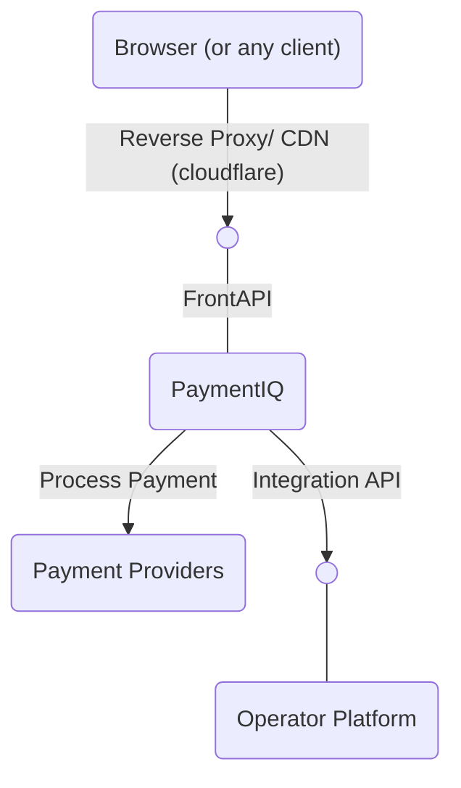

One of the main architectural goals with PaymentIQ is to have it loosely coupled from the operator's platform so the two systems can evolve independently without affecting each other. For example, payment methods can be added, modified or updated without affecting the operator's platform. The operator can update and modify it's system without affecting PaymentIQ and vice versa.

In order to achieve the separation of concerns, the integration between the operator's platform and PaymentIQ is reverted, i.e. PaymentIQ calls the Operator Platform instead of the Operator Platform calls PaymentIQ. This is why the operator needs to implement the Integration API in addition to the chosen API to connect to PaymentIQ.