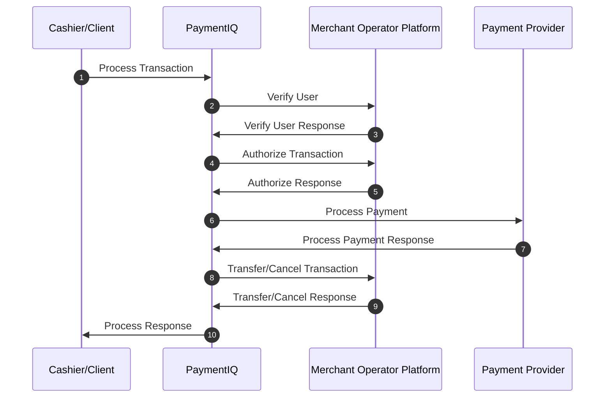

PaymentIQ offers various transaction types for the different transaction functions.

It will depend of the specific provider used if they are supported or not. Information on which are supported can be seen in the respective Provider Integration Manual.

In PaymentIQ you can see which transaction type a transaction is in the Transactions, Approve and Investigate Views in the column **Tx Type**

Deposit transactions are from the end user to the merchant account.

PaymentIQ will use different methods for the deposit depending on the provider requirements as for example a providers might need an additional parameter input. The deposit method will be indicated in the **Tx Type** column. For example:

- CreditcardDeposit
- BankDeposit
- ApcoDeposit

## Example Deposit Flow

1. Merchant calls Process Request Via PaymentIQ Cashier or FrontAPI.
2. PaymentIQ calls the Merchant Operator Platform to Verify the user.
3. The Merchant Operator Platform Verifies the user.
4. PaymentIQ Calls the Merchant Operator Platform to Authorize the transaction.
5. The Merchant Operator Platform Authorizes the transaction.
6. PaymentIQ sends a request to the Payment Provider to Process the transaction.
7. PaymentIQ gets a response from the Payment Provider.
8. PaymentIQ calls Cancel or Transfer to the Merchant Operator Platform and the Merchant updates the end user's balance accordingly.
9. The Merchant Operator Platform responds back to PaymentIQ's Transfer/Cancel request.
10. PaymentIQ responds back to the Cashier/Front API request.
