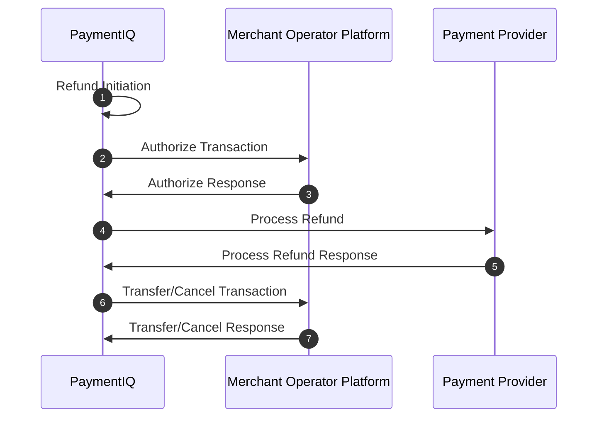

PaymentIQ offers various transaction types for the different transaction functions.

It will depend of the specific provider used if they are supported or not. Information on which are supported can be seen in the respective Provider Integration Manual.

In PaymentIQ you can see which transaction type a transaction is in the Transactions, Approve and Investigate Views in the column **Tx Type**

Refund transactions are from the merchant account to the end user. Refunds return money from a previous deposit transaction either in full or partly.

Refunds are initiated either via the PaymentIQ Backoffice Investigate View or via the Admin API. Refunds can not be initiated via the Front API. Refund transactions will be listed in the **Tx Type** column as:

- Refund
- ManualRefund

## Example Refund Flow

1. A Merchant Backoffice User initiates a refund via PaymentIQ Backoffice. 
2. PaymentIQ Calls the Merchant Operator Platform to Authorize the refund.
3. The Merchant Operator Platform Authorizes the refund.
4. PaymentIQ sends a request to the Payment Provider to Process the refund.
5. PaymentIQ gets a response from the Payment Provider.
6. PaymentIQ calls Cancel or Transfer to the Merchant Operator Platform and the Merchant updates the end user's balance accordingly.
7. The Merchant Operator Platform responds back to PaymentIQ's Transfer/Cancel request.
