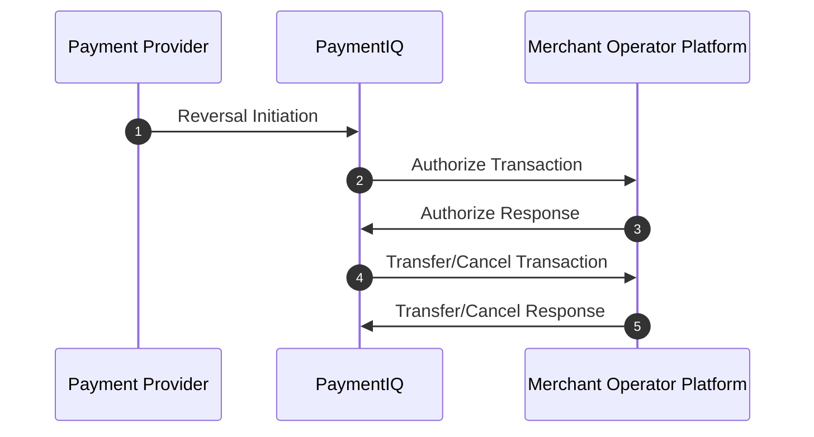

PaymentIQ offers various transaction types for the different transaction functions.

It will depend of the specific provider used if they are supported or not. Information on which are supported can be seen in the respective Provider Integration Manual.

In PaymentIQ you can see which transaction type a transaction is in the Transactions, Approve and Investigate Views in the column **Tx Type**

Reversals are provider initiated transactions that can be both from end user to merchant and merchant to end user. Reversals happen when a transactions final state receives an update from a provider. For example from successful to failed. When this happens a new transaction is created in PaymentIQ. This type of transaction only happens for a small number of providers (for example Trustly and Interac). Please check the provider integration manual to see if it is relevant in your case.

Which transaction was reversed can be seen in the **Origin tx** column in PaymentIQ.

In the transaction log (right click on the transaction and chose **view transaction**) it would typically look something like this:

```xml
    <com.devcode.paymentiq.integration.cmds.correction.ProviderReversalInput>
        <created>2020-01-22 23:08:42.719 UTC</created>
        <txType>Reversal</txType>
        <user>system</user>
        <info>Automatic reversal!</info>
        <txAmount>-16.04 CAD</txAmount>
        <amount>-16.04 CAD</amount>
    </com.devcode.paymentiq.integration.cmds.correction.ProviderReversalInput>
```

Important to note regarding reversals in regards to the Integration API is that they transpire the same way a "normal" transaction would and so will invoke the same methods. If a Merchant Operator Platform fail to respond to these requests normally the provider will keep sending the notification. And this in turn means PaymentIQ will try again with the reversal against the merchant operator platform. And in that case you will see many reversal transaction for the same original transaction with a `FAILED` state.

## Testing/Simulating Reversal transactions

Generally there is no way to test/simulate reversal transactions. Please check with the provider directly if needed.

## Example Reversal Flow



1. The Payment Provider initiates a reversal transaction by calling PaymentIQ. 
2. PaymentIQ Calls the Merchant Operator Platform to Authorize the reversal.
3. The Merchant Operator Platform Authorizes the reversal.
4. PaymentIQ calls Cancel or Transfer to the Merchant Operator Platform and the Merchant updates the end user's balance accordingly.
5. The Merchant Operator Platform responds back to PaymentIQ's Transfer/Cancel request.
