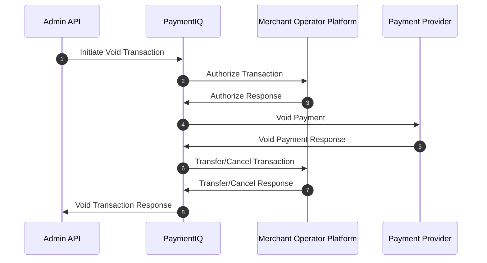

PaymentIQ offers various transaction types for the different transaction functions.

It will depend of the specific provider used if they are supported or not. Information on which are supported can be seen in the respective Provider Integration Manual.

In PaymentIQ you can see which transaction type a transaction is in the Transactions, Approve and Investigate Views in the column **Tx Type**

Credit card transactions can be cancelled (void) before they are captured and are initiated either via:

- The PaymentIQ Backoffice Investigate View.
- Rules set in PaymentIQ Backoffice for Void and Capture.
- The Admin API.

If a payment is captured, the customer has been charged and you cannot use this process and should consider making a refund instead. Void transactions will be listed in the **Tx Type** column as:

- Void
- ManualVoid

## Example Void Flow

1. The Merchant initiates a void transaction by calling PaymentIQ via the AdminAPI. 
2. PaymentIQ Calls the Merchant Operator Platform to Authorize the void.
3. The Merchant Operator Platform Authorizes the void.
4. PaymentIQ sends a request to the Payment Provider to Process the void transaction.
5. PaymentIQ gets a response from the Payment Provider.
6. PaymentIQ calls Cancel or Transfer to the Merchant Operator Platform and the Merchant updates the end user's balance accordingly.
7. The Merchant Operator Platform responds back to PaymentIQ's Transfer/Cancel request.
8. PaymentIQ responds back to the Merchants Admin API request.
