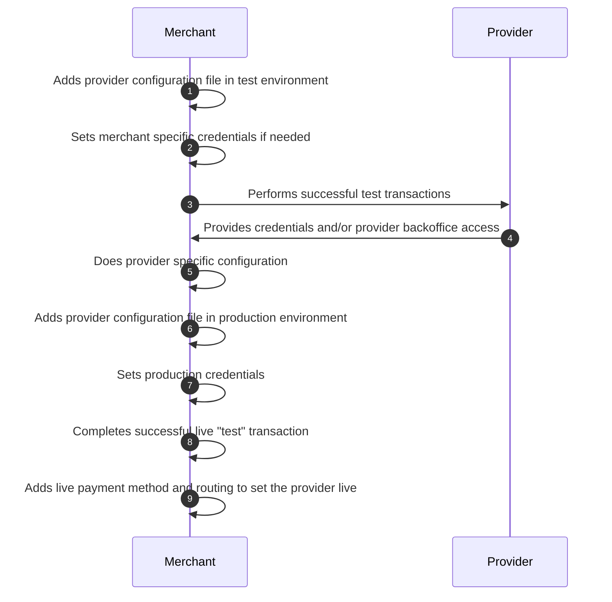

PaymentIQ is integrated with a long and expanding list of payment providers. This document is intended to give a generalized overview on the steps needed to activate and make use of a provider account.

**1)** As a fists step in using a provider the merchant should add the configuration file for PaymentIQ in the test environment.

**2)** For most providers there will be pre-set credentials that can be used for testing (PaymentIQ´s test credentials with the provider) but some providers require merchant´s to use specific credentials for testing connected with their merchant account. If that is required it is specified in the provider integration manual for that specific provider and you will need to add those to the configuration file.

**3)** Test Transaction: To go live with any provider test transactions done by the Merchant should be completed on the staging environment as a first step in order to avoid configuration issues in production.

**4)** Production Credentials: The credentials that need to be set in the PaymentIQ production backoffice are provided by the Provider that the Merchant is activating.

**5)** Production Configuration: With the credentials provided, the Merchant can follow the provider integration manual and configure the provider for production use.

**6)** The Merchant adds the production provider configuration file.

**7)** The Merchant sets the production credentials according to integration manual.

**8)** With the credentials added the Merchant should do at least one live "test" transaction to verify that the provider is working as intended

**9)** The final step to activating a provider is to add it as a payment method and to add routing intended for customers. After this is done the Merchant should monitor to make sure the transactions are successful for some time.

## Providers and APMs not listed in the documentation portal

If you are interested in activating a provider or payment method which is not listed in the PaymentIQ documentation portal we recommend that you reach out to your Account Manager or Sales contact with us to discuss this further. It could be that we are working on adding support for it soon or that it is not yet available and that development work needs to be scheduled.
