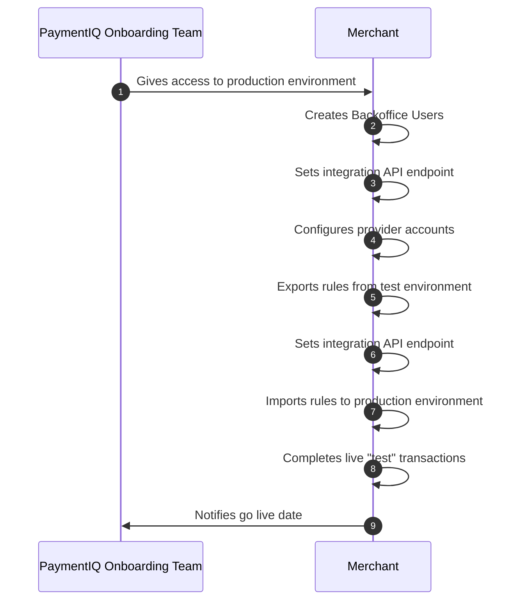

This section contains the steps needed for the production configuration for merchants integrating to PaymentIQ. 

**1)** The Merchant Backoffice Admin gets access to the production environment. 

**2)** The Merchant Backoffice Admin sets up additional backoffice users. It is very important for you as a Merchant from this point on manage your backoffice-users on your own. Therefore you need to have a clear understanding of whom on your team should have what access.

**3)** Since the Integration API has been fully tested in the Staging/Test environment, all that needs doing in production to make use of it is to specify the endpoint in the [MerchantConfig-file](/docs/apis_and_integration/integration_api/activate_integration_api).

**4)** Activate the providers by adding the provider configuration files with the credentials as specified in the Provider Integration Manual.

**5)** The Merchant Configuration Manager exports the rules using the export feature in the Test Backoffice.

**6)** The Merchant Configuration Manager imports the rules using the import feature in the Production Backoffice. Alternatively the rules can be manually entered into the system the same way it was done on the test system.

**7)** With the integration endpoint set and all rules configured the Merchant can now complete live transactions with all providers to make sure they work as intended.

**8)** When live transactions have been completed successfully the PaymentIQ Merchant Integration Team should be informed and well as updated on the go live date.