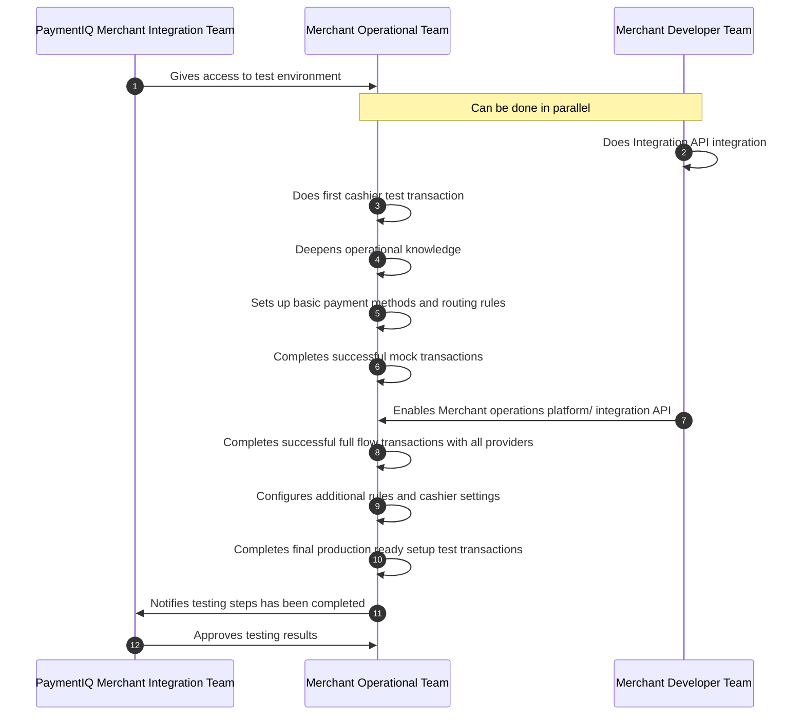

This section contains the steps needed to complete in regards to testing for merchants integrating to PaymentIQ via the Standardized Cashier. After the test steps are complete you will have performed transactions that go through the full flow and will be ready to configure the live system for live transactions.

**1)** The Merchant team gets access to test environment. If there are additional merchant staff that needs access the merchant can now manage this on their own.

**2)** The Merchant Integration Developer starts with working with the Integration API. It is important to prioritize this as further steps are dependent on it being operational.

**3)** The Merchant Configuration Manager should as a first action complete a successful test transaction using any of the available providers listed in the cashier.

**4)** The Merchant Configuration Manager should after the initial completed transaction focus on deepening knowledge about the PaymentIQ system further with the help of the user guide and asking questions to the PaymentIQ Merchant Integration Team. It is very important not to skip this step as it will speed up the onboarding process and be of use for your team when you are live.

**5)** The Merchant Configuration Manager sets up basic Payment Method and Routing Rules. These rules are required to be able to complete correctly routed test transactions with your providers. Additional types of rules can be added later.

**6)** With the basic rules added and transactions routed to the providers which will be used by the merchant the system can now complete test transactions. As the integration API is not yet completed a "Mock" API will be used to simulate the full-flow. Importantly these tests should be performed via the method(s) that will be used in production.

**7)** When the Integration API development is complete the Merchant Configuration Manager can enable it [via the MerchantConfig-file](/docs/apis_and_integration/integration_api/activate_integration_api).

**8)** With the Integration API enabled the Merchant can now complete full flow test transactions with the exact flow which will later be used in the Production environment.

**9)** After completing full test transactions the Merchant Configuration Manager should, with the help of the user guide and the Merchant requirements go over the available rule types regarding for example, limits, currency conversion and country specific routing to make sure the rules are configured exactly as will be used later on in production. Also now is a good time to do further customizations to the cashier in terms of color, layout etc.

**10)** With the full configuration and integration ready final test transactions can be performed. Tests should involve
 - All provider the Merchant intend to go live with.
 - Rules set as will later be used in production.

**11)** When all tests are successful PaymentIQ Merchant Integration Team should be notified for evaluation.

**12)** Before proceeding with the production environment configuration the PaymentIQ Merchant Integration Team evaluates the test transactions and that the Merchant has completed all the steps needed.