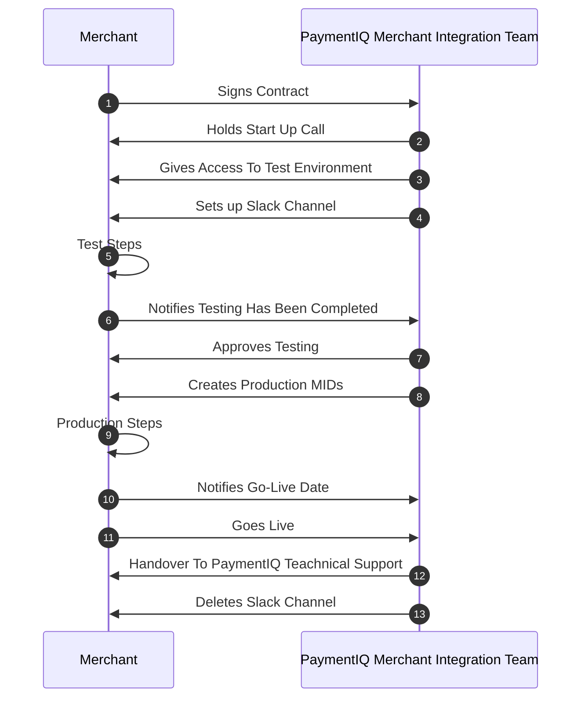

The PaymentIQ Merchant Integration Team has a long experience of helping Merchants’ through the process of going live with the PaymentIQ system.

To ensure that an onboarding project is completed on time and to meet expectations we have outlined below the steps that need to be completed.

To get a PaymentIQ system live is a technical process which require active participation of development resources and the Merchant Operational Team. An onboarding project can be completed in a short amount of time and from our experience a lack merchant commitment of time/resources and understanding of responsibilities are often the issue when deadlines are not met.

Make sure you understand the process outlined below and plan accordingly. To help with communication with the PaymentIQ Merchant Integration Team, you should always be able to tell us which step you are on and be familiar with the specific instructions for it.

# Onboarding Roadmap

**1)** The onboarding project can be started when the Merchant has signed the contract. The PaymentIQ Merchant Integration Team can not assist with questions or access to test systems until that happens.

**2)** The PaymentIQ Merchant Integration Team Manager will then schedule and hold a start-up call with the Merchant. It will cover the onboarding process, documentation, integration questions and make sure we are all on the same page regarding integration type, providers and timelines. It is very important that developers and operational staff that will be involved in the onboarding and configuration of PaymentIQ attend this meeting. It is also important that the onboarding work starts as soon as possible after this meeting so that relevant information is not forgotten.

**3)** After the start-up call the Merchant will be given access to the PaymentIQ test environment.

**4)** The PaymentIQ Merchant Integration Team will then send invites to a shared Slack Channel where questions related to the onboarding can be asked. Please note that the sales contact or account manager will not be available in this Slack Channel, only the PaymentIQ Merchant Integration Team. If The Merchant is unable to communicate via slack with The PaymentIQ Merchant Integration Team communications can alternatively be done via email. No other chat or collaborative platforms can be used.

**5)** Now that The PaymentIQ Merchant Integration Team has access to to the Test environment and can ask questions there are several steps to complete, which will differ slightly depending on the integration type. Please see the "Test Steps" sections below for full details.

**6,7)** When The Merchant has completed the full tests the PaymentIQ Merchant Integration Team should be notified. We will then check that the tests are successful and that the full transaction flow is working. If all looks to be correct you will be allowed access to the production system.

**8)** The PaymentIQ Merchant Integration Team then creates the production system and a single administrator user account.

**9)** Just as with the access to the test environment The Merchant now has several steps to complete to get the production system ready. Please see the production section below for full details.

**10)** With the production system configured and live tests completed The Merchant is ready to schedule a go live date. Please be sure to notify the PaymentIQ Merchant Integration Team via the Slack Channel well in advance of this date. It is recommended to go live at the beginning of the week.

**11)** When The Merchant starts accepting real transactions through the system it is important that you monitor that everything seems to be working as intended and to raise any concerns to the PaymentIQ Merchant Integration Team. We will be available for one week from the go live date to answer additional questions.

**12)** After one week of live transactions the merchant should start directing all questions to the PaymentIQ Technical Support Team. They will be more experienced in dealing with production questions than the PaymentIQ Merchant Integration Team and can assist on or escalate any queries you may have.

**13)** Now that The Merchant has a new contact point the Slack Channel is deleted to ensure the sensitive discussions there can not be accessed.